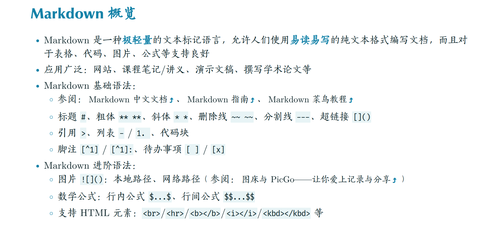
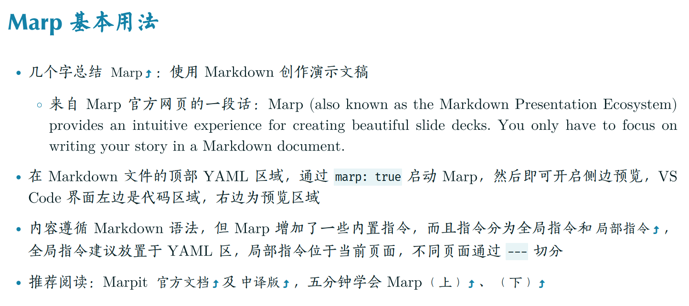
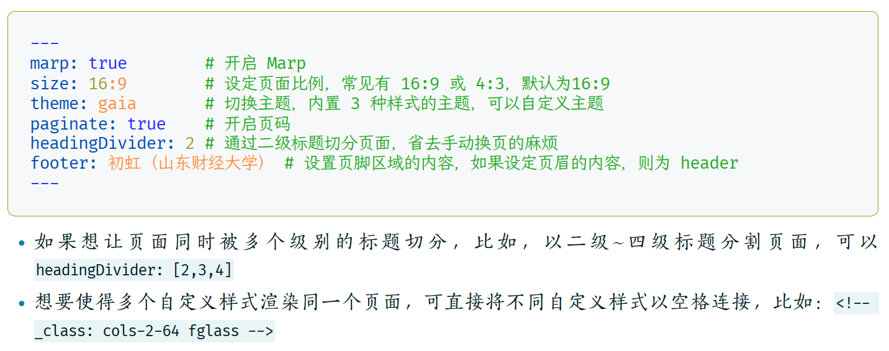
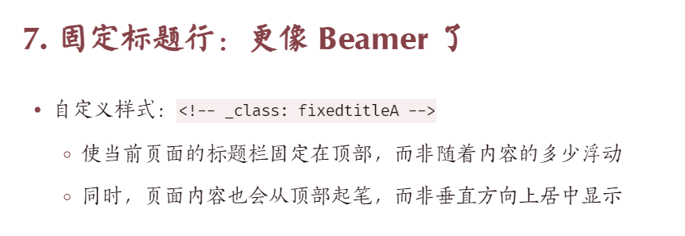
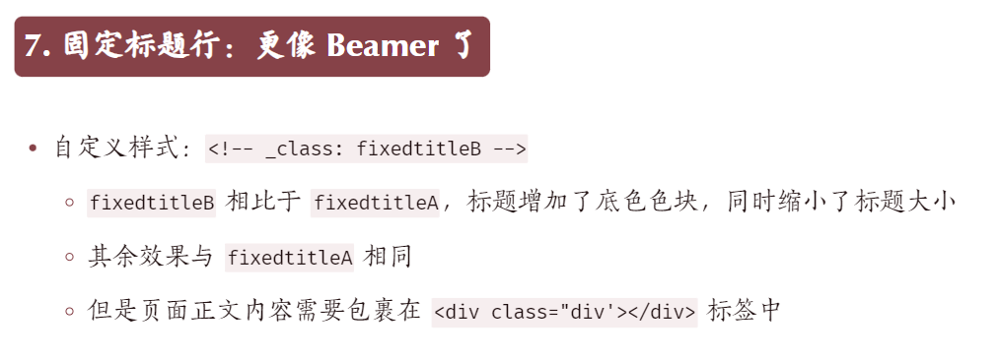
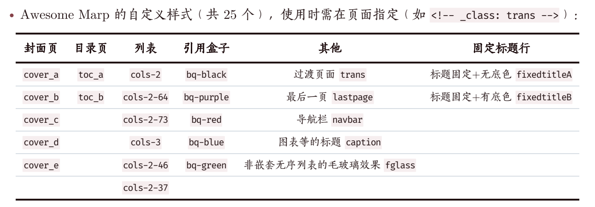

- [✨ README-en](https://github.com/favourhong/Awesome-Marp/blob/main/README-en.md)、[🎉 README-zh](https://github.com/favourhong/Awesome-Marp/blob/main/README.md)

# Awesome Marp：一整套自定义 Marp 主题

## 为什么要做 Awesome Marp？

自从了解到 Marp 可以使用 Markdown 语法来创作 PPT 之后，我有两年多没有使用 PowerPoint 做过演示文稿了。

Marp 内置的原生主题样式数量少，并且呈现效果不好看，所以一直以来我也在尝试自定义 CSS 文件，来打造符合个人审美的 theme。我在边改造边用的过程中，这套模板也得到了几位朋友的喜爱。于是索性分享出来，希望能给到你一些帮助~ 

我给这套主题还起了个名字，`Awesome Marp`，算是一个阶段性总结吧。目前 v1.1 版本提供了六种主题（分别是深色、绿色、蓝色、红色、紫色和棕色）和 25 种自定义样式。

首先，先来看一张效果动图吧~

怎么样？如果你也使用过 Marp 原生的 theme，一定会发现 Awesome-Marp 变化真的很大了。是的，我基于 Marp 的`default` 主题，做了不小的改动。

这是一个纯 CSS 的项目，所有的效果都是 CSS 语言实现的。因为并没有前端基础，所以我是一边学一边改，代码还有不少可以再完善优化的地方。但，完成比完善更重要嘛，一些小的问题可以日后迭代更新。于是，就决定将 Awesome Marp 上线了！

## 你需要了解的软件工具

就三样：Markdown 语法、Markdown 编辑器（[Visual Studio Code](https://code.visualstudio.com)）和 [Marp for VScode](https://marketplace.visualstudio.com/items?itemName=marp-team.marp-vscode) 插件！

- Markdown 

- Markdown 编辑器（如 VS Code、Obsidian）

- Marp

## Awesome Marp 的几个特色

- 支持 6 种**页面分栏**的样式：分别是两栏五五分、两栏六四分、两栏七三分、两栏四六分、两栏三七分和三栏三三分

- 支持 4 种**非嵌套列表的分栏**样式：

- 支持导航进度栏：

- 支持 5 种类型的封面页：

- 支持 3 种类型的目录页：

- 支持 5 种自定义「引用盒子」（类似于 Beamer 的定理框）：

- 如果想要更像 LaTeX Beamer，需要将标题行固定在页面顶部显示，我也支持了两种效果：

- 小彩蛋：链接会自动增加一个小尾巴：

- 还可以自定义实现图片的水平排列方式：居中对齐、居左对齐或居右对齐 
	- 图片水平居中对齐：``  
	- 图片水平居右对齐：`` 
	- 图片水平居左对齐：`` 
- …… 

总结一下，像上面的这样的自定义样式，目前 Awesome Marp 1.1 版本一共支持 25 个！使用时只需要在页面指定局部指令，比如： `<!-- _class: trans -->`）

  

不光如此，我还设计了 6 种主题色，想要切换 theme，只需要可在 YAML 区定义 `theme: <theme_name>`：

## 如何使用 Awesome Marp？

- 如果你想「拿来即用」，直接根据我分享的 Markdown 源码文件，对照修改就好了

- 如果你对部分效果不满意、期望简单微调的话，目前在 `Awesome-Marp/themes` 下有 6 个 CSS 文件，这些 CSS 文件决定了 Markdown 源码的最终渲染效果，可以试着改一改~

- 如果你能够自行定制个性化 CSS 文件，渲染之前，别忘了在 `Awesome-Marp/.vscode/settings.json` 里加上你的 CSS 文件路径，具体可参考 `./Awesome-Marp/.vscode/settings.json` 照猫画虎~

- 如果你的呈现效果与我不同，我猜可能是：
	- 你没有安装相关字体文件，因担心侵权问题，需自行下载字体并安装，Awesome Marp 用到的字体有：
	- 英文字体：`Adobe Garamond` / `Latin Modern Math` / `Optima LT Medium` / `Fira Code`
	- 中文字体：`方正宋刻本秀楷体` / `方正苏新诗柳楷简体` / `霞鹜文楷` / `叶根友毛笔行书修正版`

## 更新记录

Awesome Marp 第 1 版的样式，感觉已经基本够用了，还有一些想法没有呈现出来，我会根据自己的使用体验和大家的反馈，不定期迭代更新~ 

- `2023年9月24日`  Awesome Marp v1.0：23 种自定义样式。
- `2023年9月26日`  Awesome Marp v1.1：25 种自定义样式，在 v1.0 基础上增加固定标题行的两个样式和页面四六分栏、页面三七分栏。

---

希望对你有帮助，欢迎交流 ~ 

创作不易，buy me a coffee 🤙~ 

